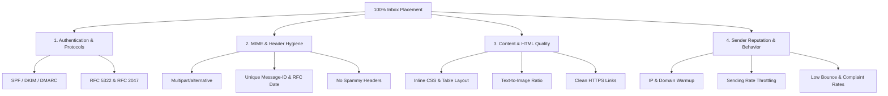

# Anti-Spam & Email Deliverability Master Guide

คู่มือเชิงลึกและหลักการที่ถูกต้องตามมาตรฐานสากล เพื่อป้องกันไม่ให้อีเมลติด Spam / Junk Mail และรักษาอัตราการส่งถึง Inbox (Inbox Placement) ให้สูงที่สุด

---

## 1. เสาหลัก 4 ด้านของการส่งอีเมลไม่ให้ติด Spam (4 Pillars of Deliverability)



---

## 2. เสาหลักที่ 1: Authentication & Protocols (การยืนยันตัวตน)

ผู้ให้บริการอีเมลชั้นนำ (Google, Microsoft, Yahoo, Apple) ตรวจสอบความถูกต้องของผู้ส่งอย่างเข้มงวด:

### 2.1 SPF (Sender Policy Framework)
* **กลไก:** กำหนด DNS TXT Record เพื่อระบุว่า Server/IP ใดมีสิทธิ์ส่งอีเมลในนามของโดเมนนั้น
* **เมื่อใช้ Gmail SMTP (@gmail.com):** Google จัดการ SPF ให้อัตโนมัติ (`v=spf1 redirect=_spf.google.com`)
* **เมื่อใช้ Custom Domain (@yourdomain.com):**
  ```dns
  yourdomain.com.  TXT  "v=spf1 include:_spf.google.com ~all"
  ```

### 2.2 DKIM (DomainKeys Identified Mail)
* **กลไก:** สร้าง Digital Signature (Public/Private Key) แนบใน Header `DKIM-Signature` เพื่อพิสูจน์ว่าอีเมลไม่ได้ถูกดัดแปลงแก้ไขระหว่างทาง
* **เมื่อใช้ Gmail SMTP:** Gmail Server จะสร้างลายเซ็น DKIM ให้โดยอัตโนมัติ **หาก Envelope From และ Header From เป็นบัญชีเดียวกัน**

### 2.3 DMARC (Domain-based Message Authentication, Reporting & Conformance)
* **กลไก:** กำหนดนโยบายให้ Mail Server ปลายทางว่าจะจัดการอย่างไรเมื่อ SPF หรือ DKIM ไม่ผ่าน (Alignment check)
* **การตั้งค่าเริ่มต้นที่แนะนำ:**
  ```dns
  _dmarc.yourdomain.com.  TXT  "v=DMARC1; p=none; sp=none; pct=100; rua=mailto:dmarc-reports@yourdomain.com"
  ```
  *(เมื่อเริ่มมีความเสถียร ให้ปรับเป็น `p=quarantine` หรือ `p=reject` เพื่อป้องกัน Spoofing)*

---

## 3. เสาหลักที่ 2: MIME & Header Hygiene (ความสะอาดของ Headers)

Spam Filter จะสแกน Headers ทุกฉบับเพื่อประเมินความน่าเชื่อถือ:

### 3.1 Headers ที่จำเป็นต้องมีเสมอ (Mandatory Headers):
1. **`Date:`** ต้องตรงตาม RFC 5322 Format เช่น `Sat, 15 Aug 2026 08:30:00 +0700`
2. **`Message-ID:`** ต้องเป็น UUID ที่ไม่ซ้ำกันต่อฉบับ เช่น `<c8b9f1a2-3456-4abc-9876-123456789abc@gmail.com>`
3. **`From:`** ชื่อผู้ส่งและอีเมลที่ถูกต้อง
4. **`To:`** อีเมลผู้รับที่ชัดเจน
5. **`Subject:`** หัวข้ออีเมล
6. **`MIME-Version: 1.0`**
7. **`Content-Type:`** โครงสร้าง Multipart ที่ถูกต้อง

### 3.2 การ Encode อักขระภาษาไทย (RFC 2047):
* หัวข้อ (`Subject`) หรือชื่อผู้ส่ง (`From Name`) ที่มีภาษาไทย ต้อง Encode เป็น UTF-8 Base64 หรือ Quoted-Printable ตามมาตรฐาน RFC 2047:
  ```http
  From: =?UTF-8?B?4Lij4Liw4Lia4Lia4LmB4LiI4LmJ4LiH4LmA4LiV4Li34Lit4LiZ?= <sender@gmail.com>
  Subject: =?UTF-8?B?4LmC4LiI4LmJ4LiH4LiB4Liy4Lij4LmB4LiI4LmJ4LiH4LmA4LiV4Li34Lit4LiZ?=
  ```
* ❌ *ห้ามส่ง raw UTF-8 ใน Subject หรือ Header เด็ดขาด เพราะ Mail Gateway บางตัวจะมองเป็น Malformed Header และจัดเป็น Spam ทันที*

### 3.3 โครงสร้าง `multipart/alternative`:
* **ต้องส่งทั้ง Text ธรรมดา (Plain Text) และ HTML เสมอ**
* ❌ *ห้ามส่งเฉพาะ HTML อย่างเดียว*: ระบบ Spam Filter จะให้คะแนน Spam Score สูงขึ้นทันทีหากไม่มี Plain Text Fallback

```http
Content-Type: multipart/alternative; boundary="----=_Part_0_987654321"

------=_Part_0_987654321
Content-Type: text/plain; charset=UTF-8
Content-Transfer-Encoding: base64

... (Plain text content) ...

------=_Part_0_987654321
Content-Type: text/html; charset=UTF-8
Content-Transfer-Encoding: base64

... (HTML content) ...

------=_Part_0_987654321--
```

### 3.4 Headers ที่ห้ามใส่โดยไม่จำเป็น:
* ❌ `X-Mailer:` (เช่น `X-Mailer: MyCustomBot 1.0` — มักโดน Spam Filter แบน)
* ❌ `Auto-Submitted: auto-generated` (ทำให้ M365 Group และ Outlook Rule ปฏิเสธการส่งเข้า Inbox สมาชิก)
* ❌ `Precedence: bulk` (ทำให้ตกแท็บ Promotions หรือ Junk)

---

## 4. เสาหลักที่ 3: Content & HTML Quality (คุณภาพของเนื้อหาและโค้ด HTML)

### 4.1 กฎการออกแบบ HTML สำหรับ Email:
1. **ใช้ Table-based Layout (`<table>`):** ไม่ใช้ `<div>` ซับซ้อนแบบ Flexbox/Grid ที่ Outlook Desktop ไม่รองรับ
2. **ใช้ Inline CSS เท่านั้น:** ไม่ใช้ `<style>` ใน Header หรือ `<link rel="stylesheet">` ภายนอก
3. **ห้ามมี Code ต้องห้าม:**
   - ❌ `<script>` (JavaScript ทุกชนิด)
   - ❌ `<iframe>`, `<embed>`, `<object>`
   - ❌ `<form>`, `<input>` (ปุ่มต้องเป็นลิงก์ `<a>` เท่านั้น)
   - ❌ `data:image/base64` ขนาดใหญ่ (ควรใช้ URL รูปภาพภายนอกที่โหลดผ่าน HTTPS)
4. **Text-to-Image Ratio:** ปริมาณตัวอักษรต้องมากกว่า 60% ของพื้นที่ทั้งหมด ห้ามส่งอีเมลที่เป็นรูปภาพแผ่นเดียวทั้งฉบับ

### 4.2 Link Hygiene (ความปลอดภัยของลิงก์):
* ลิงก์ทุกจุดต้องเป็น **HTTPS**
* **ห้ามใช้ URL Shorteners:** เช่น `bit.ly`, `tinyurl.com`, `t.co`, `goo.gl` (Spam Filter จะมองว่าพยายามซ่อน URL ปลายทาง)
* หลีกเลี่ยงการเขียน URL หลอก เช่น แสดงข้อความ `https://paypal.com` แต่ลิงก์จริงชี้ไปที่ `https://otherdomain.com` (โดน Phishing Flag ทันที)

### 4.3 คำกระตุ้นสแปม (Spam Trigger Words):
* หลีกเลี่ยงการใช้คำว่า: **"ฟรีทันที!", "รับเงิน", "ด่วนที่สุด!!!", "คลิกที่นี่เพื่อรับสิทธิ์", "100% FREE", "CONGRATULATIONS"**
* ไม่ใช้ตัวพิมพ์ใหญ่ทั้งหมดใน Subject: ❌ `URGENT ACTION REQUIRED` → ✅ `แจ้งเตือน: สรุปรายงานประจำสัปดาห์`
* ไม่ใช้เครื่องหมายวรรคตอนซ้ำๆ: ❌ `โปรดทราบ!!!` → ✅ `โปรดทราบ`

---

## 5. เสาหลักที่ 4: Sender Reputation & Warmup (พฤติกรรมและชื่อเสียงผู้ส่ง)

### 5.1 ตารางการ Warmup บัญชีผู้ส่ง (Sender Warmup Plan)
หากเริ่มส่งอีเมลจากบัญชีใหม่หรือเริ่มใช้งานระบบแจ้งเตือน ต้องค่อยๆ เพิ่มจำนวนอีเมล (Ramp-up) เพื่อสร้าง Reputation ที่ดี:

| สัปดาห์ | ปริมาณการส่งสูงสุดต่อวัน | หน่วงเวลาต่อฉบับ (Throttle) |
|---|---|---|
| **สัปดาห์ที่ 1** | 10 - 20 ฉบับ/วัน | 2,000 ms (2 วินาที) |
| **สัปดาห์ที่ 2** | 20 - 50 ฉบับ/วัน | 1,500 ms (1.5 วินาที) |
| **สัปดาห์ที่ 3** | 50 - 150 ฉบับ/วัน | 1,000 ms (1 วินาที) |
| **สัปดาห์ที่ 4 เป็นต้นไป** | 150 - 500 ฉบับ/วัน | 500 ms (0.5 วินาที) |

### 5.2 ข้อกำหนด Google & Yahoo 2024+ สำหรับผู้ส่ง:
1. **Spam Complaint Rate < 0.10%** (และต้องไม่เกิน 0.30% เด็ดขาด หากเกินจะถูก Gmail Drop อีเมลทิ้งทั้งหมด)
2. **Hard Bounce Rate < 2.0%** (ต้องคอย Clean รายชื่ออีเมลที่ไม่มีตัวตนหรือยกเลิกการใช้งานแล้วออกจากระบบสม่ำเสมอ)
3. **ส่งด้วยความเร็วสม่ำเสมอ (Rate Throttling):** ห้ามยิงอีเมล 500 ฉบับพร้อมกันภายใน 1 วินาที ให้ใช้ Worker / Queue หรือ Loop ที่มี `await delay(1000)` คั่นทุกฉบับ
